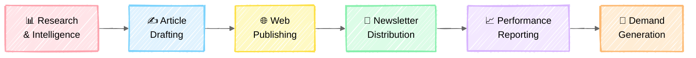
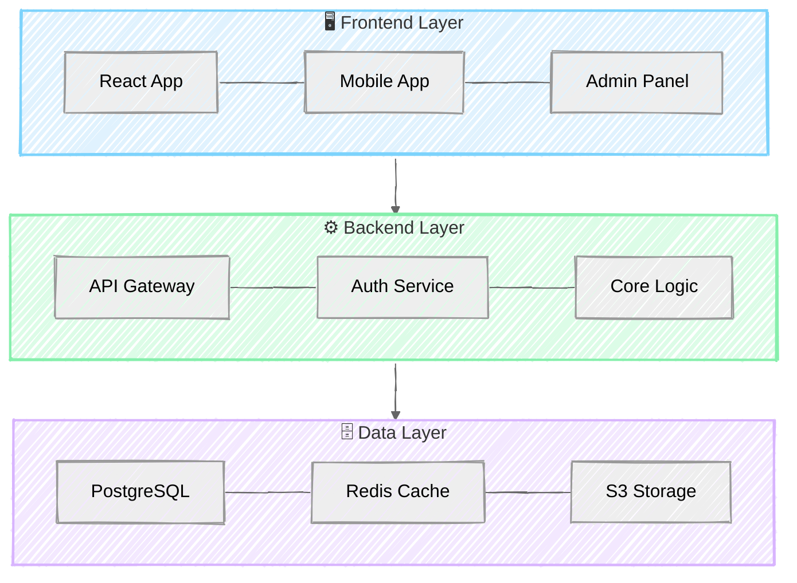
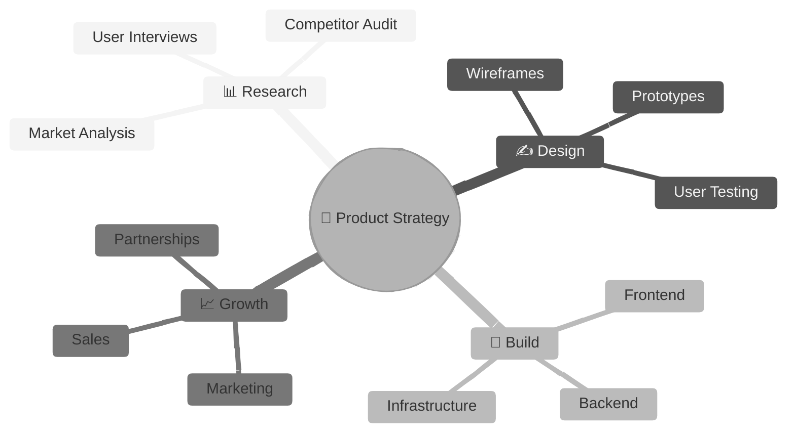
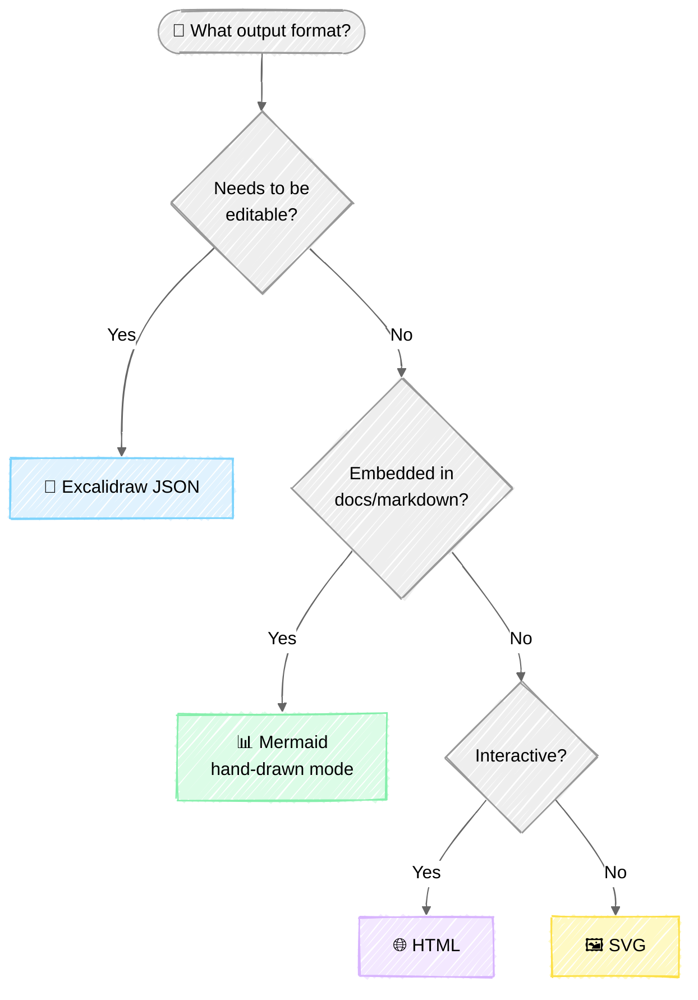

# Whiteboard Diagram Skill

Generate professional **hand-drawn whiteboard diagrams** — sketchy borders, pastel
fills, icons, and clean typography that look like someone drew them on a real
whiteboard with markers.

---

## When to Activate

Trigger this skill when the user asks to create any of:
- Whiteboard / whiteboard diagram
- Hand-drawn / sketchy diagram
- Visual architecture / system overview
- Pipeline board / process flow
- Flowchart / decision tree
- Mind map / brainstorm board
- Kanban board / status board
- Comparison chart / feature matrix
- Roadmap / timeline
- Any "make it look hand-drawn" request

---

## Output Format Decision

Pick the output format based on the user's needs. **Default to Mermaid** unless
they request something specific.

```
User wants diagram → Is it for docs/markdown?
                     ├─ YES → Mermaid (hand-drawn mode) ← DEFAULT
                     └─ NO → Needs to be editable?
                              ├─ YES → Excalidraw JSON (.excalidraw)
                              └─ NO → Needs interactivity?
                                       ├─ YES → HTML (self-contained)
                                       └─ NO → SVG (standalone)
```

| Format | Best For | File | Works In |
|--------|----------|------|----------|
| **Mermaid** | Docs, README, quick diagrams | Inline code block | GitHub, VS Code, any markdown |
| **SVG** | Standalone images, print, embed | `.svg` file | Browsers, docs, anywhere |
| **Excalidraw** | Editable boards, collaboration | `.excalidraw` file | excalidraw.com, VS Code ext |
| **HTML** | Interactive, animated boards | `.html` file | Any browser |

---

## Whiteboard Anatomy

Every hand-drawn whiteboard has these elements. Use them as building blocks:

### Core Elements

| Element | Purpose | Style |
|---------|---------|-------|
| **Title Header** | Board name, centered at top | Large bold text, accent background |
| **Section Card** | Container for a topic/stage | Rounded rect, pastel fill, sketchy border |
| **Numbered Badge** | Sequential stage indicator | Circled number: ① ② ③ ④ ⑤ ⑥ ⑦ ⑧ ⑨ |
| **Bullet List** | Details within a card | • prefixed items, regular text |
| **Output Callout** | Result/deliverable of a stage | Muted text at bottom of card |
| **Arrow** | Connection between sections | Hand-drawn arrow with label |
| **Icon/Emoji** | Visual anchor per section | Unicode emoji at card header |
| **Layer Divider** | Separates board regions | Dashed or dotted horizontal line |
| **Legend/Footer** | Context, flow summary | Small text with flow arrows at bottom |

### Layout Structure (Top to Bottom)

```
┌──────────────────────────────────────────────────────┐
│                 🎯 TITLE HEADER                       │  ← Bold, accent bg
│              Subtitle / Tagline                       │
├────────┬────────┬────────┬────────┬────────┬─────────┤
│ ① Card │ ② Card │ ③ Card │ ④ Card │ ⑤ Card │  Row 1  │  ← Pastel fills
│  Title │  Title │  Title │  Title │  Title │         │
│ ─────  │ ─────  │ ─────  │ ─────  │ ─────  │         │
│ • item │ • item │ • item │ • item │ • item │         │
│ • item │ • item │ • item │ • item │ • item │         │
│ ─────  │ ─────  │ ─────  │ ─────  │ ─────  │         │
│ Output │ Output │ Output │ Output │ Output │         │
├────────┴────────┴────────┴────────┴────────┴─────────┤
│           ─ ─ ─ ARCHITECTURE LAYER ─ ─ ─             │  ← Dashed divider
├─────────┬─────────┬─────────┬─────────┬──────────────┤
│  Group  │  Group  │  Group  │  Group  │   Row 2      │  ← Support layer
│ • item  │ • item  │ • item  │ • item  │              │
├─────────┴─────────┴─────────┴─────────┴──────────────┤
│  Flow: A → B → C → D → E → F → Greater Impact       │  ← Footer flow
└──────────────────────────────────────────────────────┘
```

---

## Color Palettes

Use **one palette per board**. The default "Pastel Rainbow" matches professional
whiteboard style. All colors are WCAG-friendly on white backgrounds.

### Palette 1: Pastel Rainbow (Default)

| Name | Fill (Background) | Border (Accent) | Use For |
|------|-------------------|------------------|---------|
| Pink | `#FFE4E8` | `#FDA4AF` | Alerts, urgent, errors |
| Blue | `#E0F2FE` | `#7DD3FC` | Tech, data, APIs |
| Yellow | `#FEF9C3` | `#FDE047` | Highlights, notes, warnings |
| Green | `#DCFCE7` | `#86EFAC` | Success, completion, growth |
| Purple | `#F3E8FF` | `#D8B4FE` | Creative, AI, premium |
| Orange | `#FFEDD5` | `#FDBA74` | Energy, action, CTAs |

### Palette 2: Ocean Breeze

| Fill | Border | Use |
|------|--------|-----|
| `#E0F7FA` | `#4DD0E1` | Backgrounds |
| `#B2EBF2` | `#26C6DA` | Primary sections |
| `#E8EAF6` | `#9FA8DA` | Secondary sections |

### Palette 3: Sunset Warm

| Fill | Border | Use |
|------|--------|-----|
| `#FFF8E1` | `#FFD54F` | Backgrounds |
| `#FFECB3` | `#FFAB91` | Primary sections |
| `#EF9A9A` | `#E57373` | Accent sections |

### Text & Stroke Colors

| Purpose | Hex | Notes |
|---------|-----|-------|
| Primary stroke / borders | `#1E1E1E` | Near-black |
| Header text | `#1E1E1E` | Bold weight |
| Body text | `#343A40` | Regular weight |
| Muted text / labels | `#6C757D` | Light weight |
| Board background | `#FFFFFF` | Clean white |

---

## Hand-Drawn Rendering Rules

These rules create the **sketchy, organic, hand-written** aesthetic:

### 1. Sketchy Borders
- Borders should look slightly **imperfect** — not perfectly straight
- Use `roughness: 1` (Excalidraw) or SVG displacement filters
- Corner radius: 8-12px for soft, friendly feel
- Border width: 2px (visible but not heavy)

### 2. Fills
- Always use **pastel fills** — never saturated or dark backgrounds
- Fill style: `solid` for clean look, `hachure` for textured look
- Opacity: 100% (fully opaque pastel, not transparent)

### 3. Typography
- **Hand-drawn fonts**: Virgil (Excalidraw), Comic Neue, Architect's Daughter, Caveat
- **Title**: 18-24px, bold
- **Body**: 12-14px, regular
- **Labels/muted**: 10-12px, light
- **Hierarchy**: Title → Subtitle → Body → Caption (max 4 levels)

### 4. Icons & Badges
- Use **Unicode emojis** for universal compatibility:
  - Business: 📊 📈 💼 🏢 🎯 💡 📋
  - Tech: ⚙️ 🔧 💻 🖥️ 🔌 🗄️ ☁️
  - Communication: 📧 📱 🔔 💬 📢 📡
  - Status: ✅ ❌ ⚠️ 🔄 ⏳ 🚀 🏆
  - People: 👤 👥 🤝 🧑‍💻 👨‍💼
  - Data: 🔍 📝 📑 📁 🗂️ 🗃️
- Numbered badges: ① ② ③ ④ ⑤ ⑥ ⑦ ⑧ ⑨ ⑩

### 5. Arrows & Connectors
- Hand-drawn style: slightly curved, not perfectly straight
- Arrowheads: simple triangles
- Label arrows with short text when connecting sections
- Use dashed arrows for optional/secondary flows

### 6. Spacing
- Card width: 180-220px (consistent within a board)
- Card height: 200-300px (varies by content)
- Gutter between cards: 16-24px
- Canvas: 1200-1600px wide × 900-1200px tall

---

## Step-by-Step Generation Guide

Follow these steps when generating any whiteboard diagram:

### Step 1: Understand the Content
- What is the board about? (system, process, comparison, brainstorm)
- How many sections/stages are there?
- What are the relationships? (sequential, hierarchical, grouped)

### Step 2: Pick the Layout Pattern
- **Pipeline Grid** — for operational stages (like the reference GovCon boards)
- **Horizontal Flow** — for simple A→B→C processes
- **Architecture Layers** — for tech stack / system layers
- **Kanban** — for task status tracking
- **Mind Map** — for brainstorming / topic breakdown
- **Comparison Matrix** — for feature/option comparison
- **Timeline** — for roadmaps and milestones

### Step 3: Pick the Color Palette
- Default to **Pastel Rainbow** unless the topic suggests another
- Assign one color per section/category — be consistent
- Reserve warm colors (pink, orange) for attention items
- Use cool colors (blue, green) for technical sections

### Step 4: Generate the Diagram
- Apply the chosen layout, palette, and hand-drawn rendering rules
- Include numbered badges for sequential stages
- Add icons/emojis for visual anchoring
- Include bullet lists for details within cards
- Add output callouts at the bottom of each card

### Step 5: Add Finishing Touches
- Title header with accent background
- Architecture/support layer if needed
- Flow summary in footer (e.g., "Ideas → Content → Distribution")
- Legend for color coding if using many colors

### Step 6: Validate Quality
Run through the quality checklist below before presenting.

---

## Mermaid Hand-Drawn Mode (Primary Output)

Mermaid v11+ supports native hand-drawn rendering. This is the **default output**
because it works everywhere — GitHub, VS Code, documentation, any markdown.

### Basic Setup

Add this directive at the top of any Mermaid diagram:

```
%%{init: {"look": "handDrawn", "theme": "neutral"}}%%
```

For deterministic rendering (same look every time):

```
%%{init: {"look": "handDrawn", "handDrawnSeed": 42, "theme": "neutral"}}%%
```

### Example: Pipeline Board



### Example: Architecture Layers



### Example: Mind Map



### Example: Decision Flowchart



### Supported Diagram Types

All these support `look: handDrawn`:
- `flowchart` / `graph` — flowcharts and process diagrams
- `sequenceDiagram` — interaction sequences
- `classDiagram` — class/object relationships
- `stateDiagram` — state machines
- `erDiagram` — entity relationships
- `mindmap` — brainstorm / topic maps
- `gantt` — timelines and schedules
- `gitGraph` — git branch visualization
- `pie` — pie charts
- `quadrantChart` — 2×2 matrices
- `timeline` — event sequences
- `block-beta` — block/architecture diagrams

---

## SVG Output (Standalone)

For standalone SVG files with hand-drawn aesthetics, use **SVG displacement
filters** to make perfectly drawn shapes look sketchy.

### SVG Hand-Drawn Filter

Apply this filter to shape groups (NOT text) for sketchy effect:

```xml
<svg xmlns="http://www.w3.org/2000/svg" viewBox="0 0 1200 900">
  <defs>
    <!-- Hand-drawn wobble filter -->
    <filter id="sketchy" x="-5%" y="-5%" width="110%" height="110%">
      <feTurbulence type="fractalNoise" baseFrequency="0.03"
                    numOctaves="3" result="noise" seed="5"/>
      <feDisplacementMap in="SourceGraphic" in2="noise"
                         scale="3" xChannelSelector="R"
                         yChannelSelector="G"/>
    </filter>
  </defs>

  <!-- Apply filter to shapes, NOT text -->
  <g filter="url(#sketchy)">
    <rect x="50" y="50" width="200" height="120" rx="10"
          fill="#FFE4E8" stroke="#FDA4AF" stroke-width="2"/>
  </g>

  <!-- Text without filter (stays crisp) -->
  <text x="150" y="100" text-anchor="middle"
        font-family="Comic Neue, Caveat, cursive" font-size="18"
        fill="#1E1E1E">Section Title</text>
</svg>
```

### Key SVG Techniques

| Technique | How | Effect |
|-----------|-----|--------|
| Displacement filter | `<feTurbulence>` + `<feDisplacementMap>` | Wobbly borders |
| Rough.js SVG mode | `rough.svg(element)` | Sketchy shapes |
| Dash array | `stroke-dasharray="5,3"` | Dashed borders |
| Hand-drawn fonts | `font-family: "Comic Neue"` | Handwritten text |

### Filter Parameters

| Parameter | Value | Effect |
|-----------|-------|--------|
| `baseFrequency` | `0.02-0.05` | Lower = larger wobbles |
| `numOctaves` | `2-4` | More = finer noise detail |
| `scale` | `2-5` | Higher = more displacement |
| `seed` | any integer | Deterministic randomness |

---

## Excalidraw JSON Output

For editable whiteboard files, generate `.excalidraw` JSON. These can be opened
in excalidraw.com or the VS Code Excalidraw extension.

### Minimal Excalidraw Document

```json
{
  "type": "excalidraw",
  "version": 2,
  "source": "whiteboard-diagram-skill",
  "elements": [],
  "appState": {
    "viewBackgroundColor": "#FFFFFF",
    "gridSize": null
  },
  "files": {}
}
```

### Element Templates

**Rectangle (Section Card):**
```json
{
  "id": "unique-id",
  "type": "rectangle",
  "x": 100, "y": 100,
  "width": 220, "height": 280,
  "strokeColor": "#FDA4AF",
  "backgroundColor": "#FFE4E8",
  "fillStyle": "solid",
  "strokeWidth": 2,
  "strokeStyle": "solid",
  "roughness": 1,
  "opacity": 100,
  "roundness": { "type": 3 },
  "seed": 42,
  "isDeleted": false
}
```

**Text:**
```json
{
  "id": "unique-id",
  "type": "text",
  "x": 120, "y": 110,
  "width": 180, "height": 25,
  "text": "Section Title",
  "fontSize": 18,
  "fontFamily": 1,
  "textAlign": "left",
  "verticalAlign": "top",
  "strokeColor": "#1E1E1E",
  "seed": 43,
  "isDeleted": false
}
```

**Arrow:**
```json
{
  "id": "unique-id",
  "type": "arrow",
  "x": 320, "y": 240,
  "width": 60, "height": 0,
  "strokeColor": "#1E1E1E",
  "strokeWidth": 2,
  "roughness": 1,
  "points": [[0, 0], [60, 0]],
  "startArrowhead": null,
  "endArrowhead": "arrow",
  "seed": 100,
  "isDeleted": false
}
```

### Key Excalidraw Properties

| Property | Values | Whiteboard Default |
|----------|--------|--------------------|
| `roughness` | `0` clean, `1` sketchy, `2` very rough | `1` |
| `fillStyle` | `"solid"`, `"hachure"`, `"cross-hatch"` | `"solid"` |
| `strokeStyle` | `"solid"`, `"dashed"`, `"dotted"` | `"solid"` |
| `fontFamily` | `1` Virgil, `2` Helvetica, `3` Cascadia | `1` |
| `roundness` | `null` sharp, `{type: 3}` rounded | `{type: 3}` |

---

## HTML Output (Interactive)

For self-contained interactive whiteboards, generate a single HTML file using
Rough.js for hand-drawn rendering.

### Template

```html
<!DOCTYPE html>
<html lang="en">
<head>
  <meta charset="UTF-8">
  <meta name="viewport" content="width=device-width, initial-scale=1.0">
  <title>Whiteboard Diagram</title>
  <script src="https://cdn.jsdelivr.net/npm/roughjs@4.6.6/bundled/rough.min.js"></script>
  <style>
    body {
      margin: 0; padding: 20px;
      background: #FFFFFF;
      font-family: 'Comic Neue', 'Caveat', cursive, sans-serif;
    }
    svg { width: 100%; max-width: 1400px; margin: 0 auto; display: block; }
  </style>
</head>
<body>
  <svg id="whiteboard" viewBox="0 0 1400 900"></svg>
  <script>
    const svg = document.getElementById('whiteboard');
    const rc = rough.svg(svg);

    // Card with hand-drawn border
    const card = rc.rectangle(50, 100, 220, 280, {
      fill: '#FFE4E8',
      fillStyle: 'solid',
      stroke: '#FDA4AF',
      strokeWidth: 2,
      roughness: 1.2,
      seed: 42
    });
    svg.appendChild(card);

    // Title text (added as SVG text, not rough)
    const title = document.createElementNS('http://www.w3.org/2000/svg', 'text');
    title.setAttribute('x', '160');
    title.setAttribute('y', '135');
    title.setAttribute('text-anchor', 'middle');
    title.setAttribute('font-size', '18');
    title.setAttribute('font-weight', 'bold');
    title.setAttribute('fill', '#1E1E1E');
    title.textContent = '① Research Phase';
    svg.appendChild(title);

    // Arrow connector
    const arrow = rc.line(270, 240, 340, 240, {
      stroke: '#1E1E1E',
      strokeWidth: 2,
      roughness: 1
    });
    svg.appendChild(arrow);
  </script>
</body>
</html>
```

### Rough.js Key Options

| Option | Default | Whiteboard Setting | Effect |
|--------|---------|-------------------|--------|
| `roughness` | `1` | `1-1.5` | Sketch intensity |
| `bowing` | `1` | `1` | Line curvature |
| `fillStyle` | `"hachure"` | `"solid"` | Fill rendering |
| `fillWeight` | `0.5` | `1.5` | Hatch line weight |
| `hachureAngle` | `-41` | `-41` or `60` | Hatch direction |
| `hachureGap` | `4` | `8` | Hatch spacing |
| `seed` | random | fixed integer | Deterministic look |

---

## Prompt Templates

Use these templates when the user's request is vague. Fill in the blanks and
generate the diagram.

### Template 1: Pipeline Board
```
Create a hand-drawn whiteboard showing a [N]-stage pipeline for [TOPIC].
Stages: [stage1], [stage2], ... [stageN]
Each stage has: title, 3-5 bullet points, output/deliverable
Layout: [N/5]-column grid with numbered badges ①②③...
Color: Pastel Rainbow palette, one color per stage
Footer: Flow summary arrow
```

### Template 2: Architecture Diagram
```
Create a hand-drawn whiteboard showing the architecture of [SYSTEM].
Layers: [layer1] (top), [layer2] (middle), [layer3] (bottom)
Each layer contains: 3-5 components with icons
Layout: Stacked horizontal layers
Color: Blue for frontend, Green for backend, Purple for data
Arrows: Downward between layers
```

### Template 3: Flowchart / Decision Tree
```
Create a hand-drawn flowchart for [PROCESS].
Start: [entry point]
Decisions: [decision1] → yes/no, [decision2] → yes/no
Endpoints: [outcome1], [outcome2], [outcome3]
Layout: Top-down flow
Color: Green for success paths, Pink for error paths, Yellow for decisions
```

### Template 4: Kanban Board
```
Create a hand-drawn kanban board for [PROJECT].
Columns: TODO, IN PROGRESS, IN REVIEW, DONE
Cards: [list of tasks with their status]
Layout: 4-column vertical layout
Color: Each column gets a different pastel color
Icons: 📋 TODO, 🔄 In Progress, 🔍 Review, ✅ Done
```

### Template 5: Comparison Chart
```
Create a hand-drawn comparison board for [OPTIONS].
Options: [option1], [option2], [option3]
Criteria: [criteria1], [criteria2], [criteria3], [criteria4]
Layout: Matrix/table with colored cells
Color: Green for pros, Pink for cons, Yellow for neutral
```

---

## Quality Checklist

Before presenting any whiteboard diagram, verify:

- [ ] **Hand-drawn feel** — borders look sketchy/imperfect, not machine-perfect
- [ ] **Pastel fills** — soft, light background colors (not saturated or dark)
- [ ] **Consistent palette** — using one palette, not mixing random colors
- [ ] **Icons/emojis** — each section has a visual anchor
- [ ] **Numbered badges** — sequential stages use ① ② ③ etc.
- [ ] **Typography hierarchy** — title > subtitle > body > caption
- [ ] **Readable text** — text is NOT distorted by sketch filters
- [ ] **Connecting arrows** — related sections are visibly connected
- [ ] **Output callouts** — each stage shows its deliverable/result
- [ ] **Clean layout** — consistent card sizes, even gutters, aligned grid
- [ ] **Title header** — board has a clear title at the top
- [ ] **White background** — board background is white or near-white

---

## Additional References

For extended examples, color palettes, layout patterns, and code snippets,
see the `references/` directory:

- `references/color-palettes.md` — 6 curated palettes with hex codes and usage
- `references/layout-patterns.md` — 7 layout patterns with ASCII previews
- `references/excalidraw-examples.md` — Ready-to-import Excalidraw JSON
- `references/mermaid-handdrawn-examples.md` — Copy-paste Mermaid diagrams
