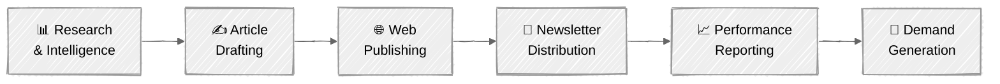
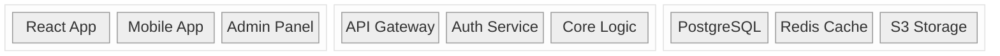
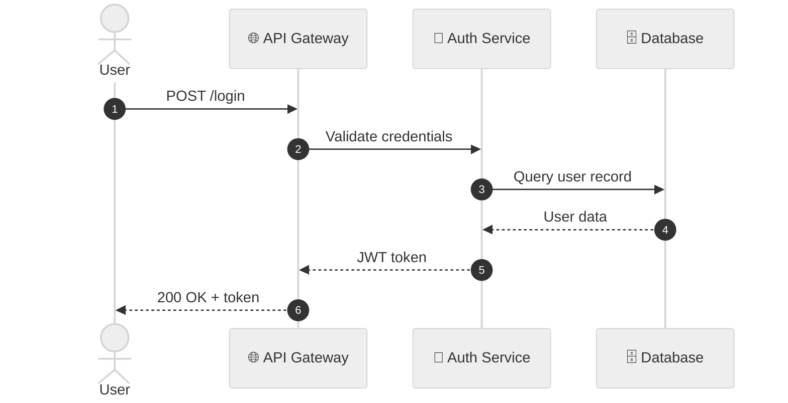
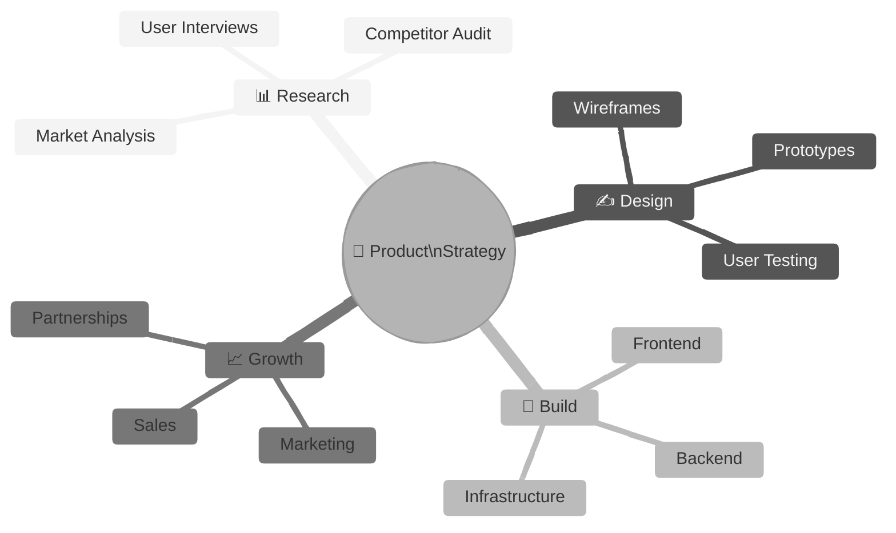
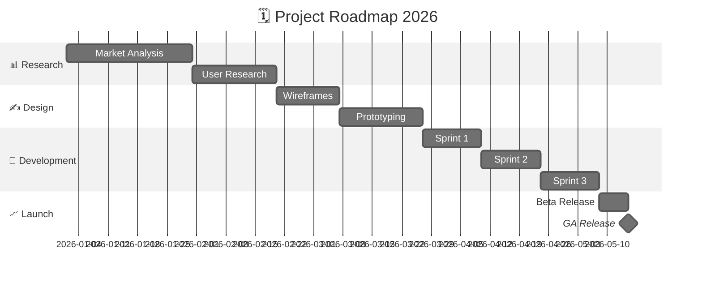
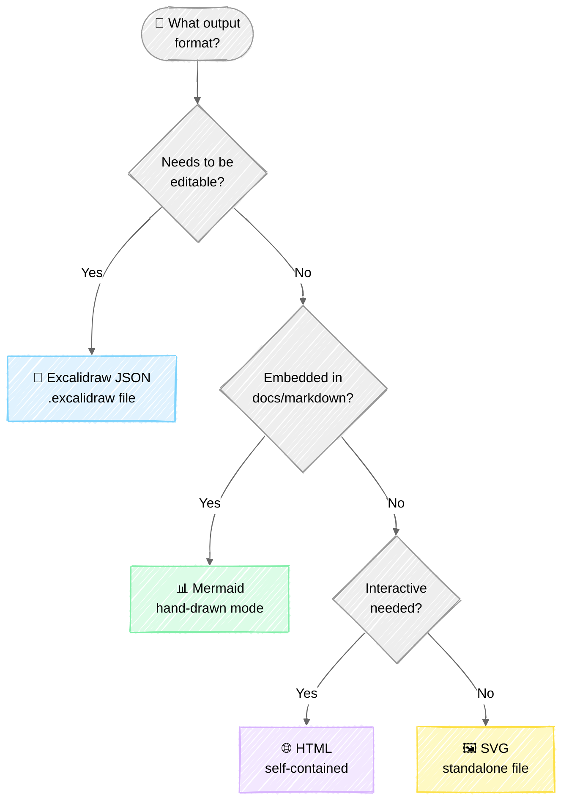
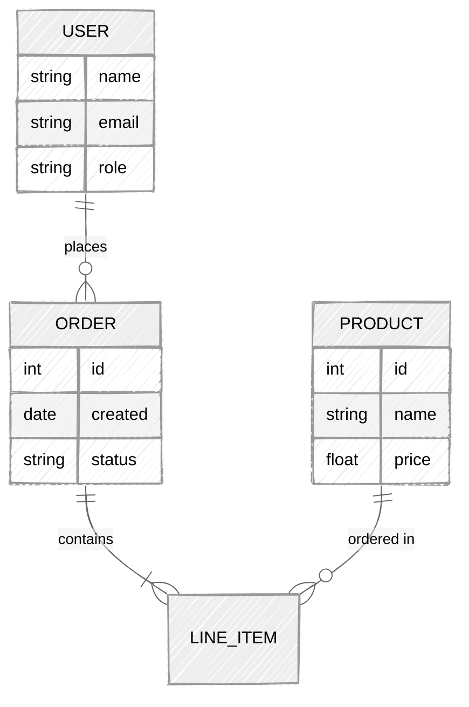

# Mermaid Hand-Drawn Mode — Examples Reference

Ready-to-use Mermaid diagram code with `look: handDrawn`. Copy into any Markdown file, Mermaid Live Editor, or documentation system.

> **Requires**: Mermaid v11+ for `look: handDrawn` support.

---

## Example 1: Pipeline Flowchart



## Example 2: Architecture Layers



## Example 3: Sequence Diagram



## Example 4: Mind Map



## Example 5: Gantt / Timeline



## Example 6: Decision Flowchart



## Example 7: Entity Relationship (ER) Diagram



## Configuration Reference

### Minimal Hand-Drawn Config
```
%%{init: {"look": "handDrawn"}}%%
```

### Full Config with Seed (Deterministic)
```
%%{init: {"look": "handDrawn", "handDrawnSeed": 42, "theme": "neutral"}}%%
```

### Config via Frontmatter
```
---
config:
  look: handDrawn
  handDrawnSeed: 42
  theme: neutral
---
```

### Supported Diagram Types with Hand-Drawn
| Diagram Type | Supported | Notes |
|-------------|-----------|-------|
| Flowchart | ✅ | Best support |
| Sequence | ✅ | Full support |
| Class | ✅ | Full support |
| State | ✅ | Full support |
| ER Diagram | ✅ | Full support |
| Mindmap | ✅ | Great for brainstorming |
| Gantt | ✅ | Timeline views |
| Git Graph | ✅ | Repo visualization |
| Block | ✅ | Architecture diagrams |
| Pie | ✅ | Data visualization |
| Quadrant | ✅ | 2x2 matrices |
| Timeline | ✅ | Event sequences |
